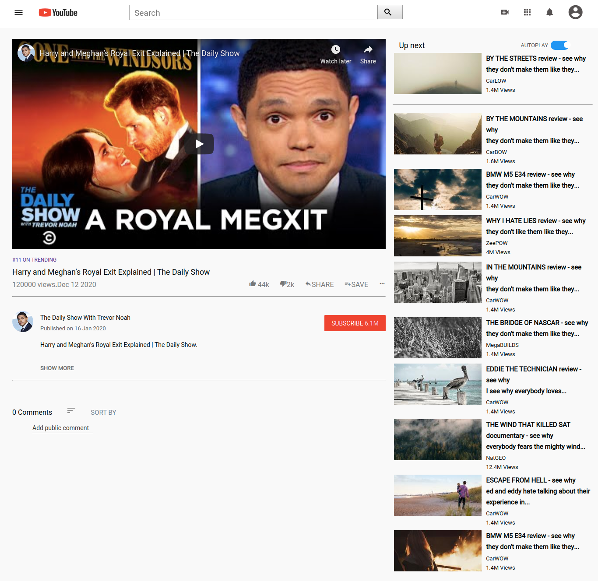

# YouTube Clone

> This is a youtube clone project. 

The project was a collaboration. The project uses basic html5 and css3. 

## Built With

- Html5,
- css3.

## Live Demo

[Live Demo Link](https://menyagah.github.io/youTube_clone/)

## Getting Started

This is a basic html5 and css3 webpage that is static. Simply clone or download the files from the github repo and click on index.html to launch the webpage.

## Authors

👤 **Author1**

- Github: [@menyagah](https://github.com/menyagah)
- Twitter: [@Martinnyaga20](https://twitter.com/Martinnyaga20)
- Linkedin: [linkedin](https://linkedin.com/linkedinhandle)

👤 **Author2**

- Github: [@githubhandle](https://github.com/githubhandle)
- Twitter: [@twitterhandle](https://twitter.com/twitterhandle)
- Linkedin: [linkedin](https://linkedin.com/linkedinhandle)

## 🤝 Contributing

Contributions, issues and feature requests are welcome!

Feel free to check the [issues page](issues/).

## Show your support

Give a ⭐️ if you like this project!

## Acknowledgments

- Much guidance on css flexbox and the grid system was given by a course on udemy by jonasschmedtman.
- Twitter: [@jonasschmedtman](https://twitter.com/jonasschmedtman)
- Resource : [Udemy](https://www.udemy.com/course/advanced-css-and-sass/learn/lecture/8274380#overview)

## 📝 License

This project is [MIT](lic.url) licensed.
